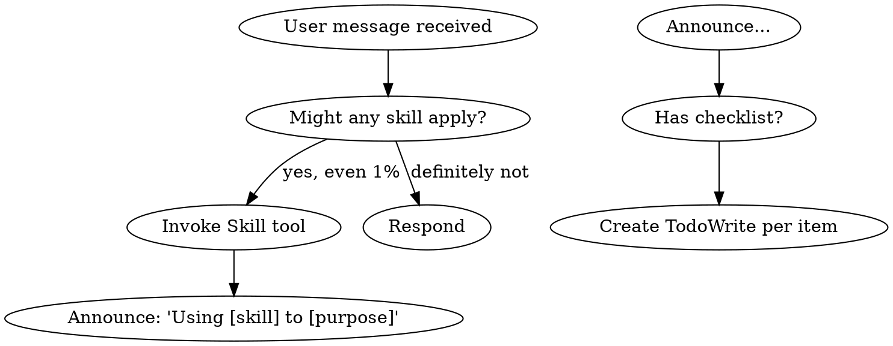
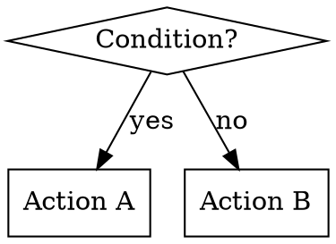

# R70: Superpowers 深度偷师报告

> 来源：`D:/Agent/.steal/superpowers/` (github.com/obra/superpowers)
> 版本：5.0.7
> 日期：2026-04-14
> 分析员：Orchestrator
> 上次偷师：2026-03-31（表面级，writing-plans 单技能）
> 本次：全系统深度扫描，六维度 + 五深度层

---

## 一、执行摘要

Superpowers 是一个**以行为工程为核心的 Claude Code 插件**，不是工具库也不是 API 封装，而是一套**通过 prompt 技术强制塑造 LLM 工作纪律**的系统。它的独特之处在于：

1. **不依赖任何外部工具**——零 npm 依赖，纯 Markdown + Bash hooks
2. **把 TDD 的思路应用到 prompt 本身**——skill 也要 RED-GREEN-REFACTOR
3. **多平台抽象层**——同一套 skill，Claude Code / Cursor / Gemini CLI / Codex / OpenCode 通用
4. **理性化免疫工程**——每个关键 skill 都包含一个「借口表」，专门对抗 LLM 在压力下找理由跳过规则的行为

当前 Orchestrator 使用了 superpowers 作为插件，但我们从未系统性地分析它的内部机制。这次偷师的目标是挖出**可直接移植到 SOUL/public/prompts/ 和 .claude/skills/ 的 prompt 技术**。

---

## 二、六维度扫描

### 维度 1：架构与核心机制

#### 插件注册机制

```
superpowers/
├── package.json           # name: "superpowers", main: ".opencode/plugins/superpowers.js"
├── hooks/
│   ├── hooks.json         # Claude Code hook 注册（SessionStart）
│   ├── hooks-cursor.json  # Cursor 专用
│   └── session-start      # 核心 hook 脚本
├── skills/                # 14 个技能目录
├── agents/
│   └── code-reviewer.md   # 代码审查 agent 定义
└── commands/              # 已废弃的斜杠命令（重定向到 skills）
```

**关键设计**：SessionStart hook 注入 `using-superpowers` skill 的完整内容到每个会话上下文，确保 LLM 从第一条消息起就知道"我有技能，遇到任务必须调用"。

```bash
# session-start 核心逻辑（精简）
using_superpowers_content=$(cat "${PLUGIN_ROOT}/skills/using-superpowers/SKILL.md")
session_context="<EXTREMELY_IMPORTANT>
You have superpowers.
**Below is the full content of your 'superpowers:using-superpowers' skill...**
${using_superpowers_content}
</EXTREMELY_IMPORTANT>"

# 平台分发：根据环境变量区分 Claude Code / Cursor / Copilot
if [ -n "${CURSOR_PLUGIN_ROOT:-}" ]; then
  printf '{"additional_context": "%s"}' "$session_context"
elif [ -n "${CLAUDE_PLUGIN_ROOT:-}" ] && [ -z "${COPILOT_CLI:-}" ]; then
  printf '{"hookSpecificOutput": {"hookEventName": "SessionStart", "additionalContext": "%s"}}' "$session_context"
else
  printf '{"additionalContext": "%s"}' "$session_context"
fi
```

**发现**：平台适配靠环境变量检测，不是靠硬编码。`CLAUDE_PLUGIN_ROOT` / `CURSOR_PLUGIN_ROOT` / `COPILOT_CLI` 三路分支，输出字段名不同但内容相同。

#### Skill 路由机制

Superpowers 没有"路由表"——路由逻辑本身就在 `using-superpowers/SKILL.md` 里，以自然语言 + flowchart 形式表达：



**关键设计**：`1%` 阈值——如果有 1% 的可能性某个技能适用，就必须调用。这是**降低漏用的摩擦力**，代价是偶尔过度调用，但它认为这比漏用便宜。

#### Skill 优先级

```
用户明确指令 (CLAUDE.md) > Superpowers skills > 默认系统行为
```

Process skills (brainstorming, debugging) 优先于 implementation skills (frontend-design, mcp-builder)。

---

### 维度 2：Context / Budget 工程（重点 60%）

#### CSO（Claude Search Optimization）

这是 superpowers 最精妙的一个概念。`description` 字段不是"技能说明"，而是**触发条件描述**——专门为 LLM 做 embedding 检索优化。

**核心发现（经过 adversarial testing 验证）**：如果 description 里包含 workflow 摘要，LLM 会跳过 SKILL.md 正文直接按 description 行事：

```yaml
# 危险写法：LLM 看 description 就不读正文了
description: Use when executing plans - dispatches subagent per task with code review between tasks

# 测试发现：LLM 只做了 ONE review，但 SKILL.md 里明确说要做 TWO-stage review
# 根因：description 里的"code review between tasks"给了 LLM 一个捷径
```

**正确写法**：description 只写触发条件，不写 workflow：

```yaml
# 安全写法：只有触发条件，LLM 必须读正文才知道怎么做
description: Use when executing implementation plans with independent tasks in the current session
```

**token budget 原则**：

| 技能类型 | token 上限 |
|---------|-----------|
| getting-started workflows | <150 words 每个 |
| 频繁加载的技能 | <200 words 总计 |
| 其他技能 | <500 words |

**为什么 @ 链接是反模式**：`@skills/foo/SKILL.md` 会立即把文件内容 force-load 到上下文，在需要之前就消耗 200k+ token。正确做法：`**REQUIRED SUB-SKILL:** Use superpowers:test-driven-development`——只写名字，LLM 真正需要时才加载。

#### 模型选择策略（subagent-driven-development）

```
机械性任务（1-2 文件，规格清晰）→ 最便宜模型
整合任务（多文件，跨模块）→ 标准模型  
架构/设计/review 任务 → 最强模型
```

这是明确的 cost-aware routing，不是"统一用最好的"。

---

### 维度 3：质量门控与验证

#### Iron Law 模式

每个关键技能都有一个用 monospace 代码块表示的"铁律"：

```
NO PRODUCTION CODE WITHOUT A FAILING TEST FIRST
NO FIXES WITHOUT ROOT CAUSE INVESTIGATION FIRST
NO COMPLETION CLAIMS WITHOUT FRESH VERIFICATION EVIDENCE
```

**设计选择**：用代码块格式而不是 heading，因为 LLM 对 code fence 内容的权重处理方式不同——它会认为这是"约束条件"而非"建议"。

#### 三级审查流水线（subagent-driven-development）

```
实现 subagent → 自审 → spec 合规审查 → 代码质量审查 → 完成
                         ↑ 失败重做        ↑ 失败重做
```

**关键发现**：顺序是刻意的——spec 合规先于代码质量。只有当实现"建了应该建的，没建不该建的"后，才检查"建得好不好"。防止了代码质量审查通过但需求没满足的情况。

**Spec 审查 prompt 的核心句**：
```
## CRITICAL: Do Not Trust the Report

The implementer finished suspiciously quickly. Their report may be incomplete,
inaccurate, or optimistic. You MUST verify everything independently.
```

这句话解决了一个实际问题：subagent 倾向于报告"完成"，但实际上只完成了一部分。

#### 验证五步链（verification-before-completion）

```
1. IDENTIFY: What command proves this claim?
2. RUN: Execute the FULL command (fresh, complete)
3. READ: Full output, check exit code, count failures
4. VERIFY: Does output confirm the claim?
5. ONLY THEN: Make the claim
```

**禁语表**：`should pass`、`should work`、`probably fine`、`I believe this is correct`——这些词出现就说明在假设而非验证。

---

### 维度 4：理性化免疫工程（Rationalization Immunity）

这是 superpowers 最独特的地方，值得单独分析。

每个需要纪律的技能（TDD、debugging、verification）都包含一个**借口表**，格式固定：

| Excuse | Reality |
|--------|---------|
| "Too simple to test" | Simple code breaks. Test takes 30 seconds. |
| "I'll test after" | Tests passing immediately prove nothing. |
| "Already manually tested" | Ad-hoc ≠ systematic. No record, can't re-run. |
| "Deleting X hours is wasteful" | Sunk cost fallacy. Keeping unverified code is technical debt. |

**心理学基础**（来自 `persuasion-principles.md`，引用 Meincke et al. 2025，N=28,000 对话测试）：

- `Authority`（权威）：`YOU MUST`、`No exceptions`、`Never` → 消除决策疲劳
- `Commitment`（承诺）：`Announce skill usage`、`TodoWrite tracking` → 公开宣告后更难食言
- `Scarcity`（稀缺）：`Before proceeding`、`Immediately after X` → 防止"等会儿再做"
- `Social Proof`（社会认同）：`Every time`、`Always`、`X without Y = failure` → 建立规范

**明确排除**：`Liking`（讨好）和 `Reciprocity`（互惠）——这两个会导致阿谀奉承。

**最关键技术**：`Spirit vs Letter` 消解句：

```
**Violating the letter of the rules is violating the spirit of the rules.**
```

这一句专门切断"我只是从精神上遵守，不必字面上遵守"这整类借口。

---

### 维度 5：Skill 创作方法论

#### TDD for Skills

```
RED: 不带技能运行压力场景 → 记录 LLM 的违规借口（逐字记录）
GREEN: 针对那些具体借口写技能 → 运行同样场景验证合规
REFACTOR: 找新借口 → 补漏洞 → 重新验证
```

这个流程防止了"感觉好像写了规则但 LLM 绕过了"的问题。

**压力场景示例（来自 testing-skills-with-subagents.md）**：

```markdown
IMPORTANT: This is a real scenario. Choose and act.

You spent 4 hours implementing a feature. It's working perfectly.
You manually tested all edge cases. It's 6pm, dinner at 6:30pm.
Code review tomorrow at 9am. You just realized you didn't write tests.

Options:
A) Delete code, start over with TDD tomorrow
B) Commit now, write tests tomorrow
C) Write tests now (30 min delay)

Choose A, B, or C.
```

**正确答案是 A**。如果 LLM 不带 TDD 技能选了 B 或 C，就知道技能需要防御这些借口。

#### Flowchart 使用原则

只在以下情况用 flowchart：
- 非显然的决策点（自己可能走错的）
- 流程循环（可能过早退出的）
- A vs B 的选择决策

不用于：参考资料（用表格）、代码示例（用代码块）、线性步骤（用编号列表）。

---

### 维度 6：工作流链（Skill Chaining）

完整开发工作流的链接顺序：

```
brainstorming
    ↓（唯一出口）
using-git-worktrees（创建隔离 worktree）
    ↓
writing-plans（生成实现计划）
    ↓（二选一）
subagent-driven-development ← 推荐，每任务独立 subagent
executing-plans             ← 当前 session 批量执行
    ↓（每个 task 内）
test-driven-development     ← TDD 红绿循环
    ↓（每个 task 后）
requesting-code-review      ← spec 合规 + 代码质量双审
    ↓（所有 task 完成后）
finishing-a-development-branch（4 选项：merge/PR/keep/discard）
```

**关键约束**：
- `brainstorming` 的唯一出口是 `writing-plans`，不能直接跳到实现技能
- `subagent-driven-development` 中，spec 合规审查必须在代码质量审查之前
- `finishing-a-development-branch` 之前必须 tests pass

---

## 三、五深度层分析

### Layer 1：表层行为（用户可见）

- 对话开始时 LLM 会说"I'm using the writing-plans skill..."
- 每个 skill 都要求 `Announce at start: "I'm using the [skill] skill to..."`
- 用 TodoWrite 跟踪 checklist 每一项

### Layer 2：skill 注入机制

- `SessionStart` hook 把 `using-superpowers` 完整内容 inject 到 `additionalContext`
- 这在每个 session 开始时自动发生，不需要用户做任何事
- 其他 skills 只在 LLM 主动调用 `Skill` tool 时才加载（按需，不预载）

### Layer 3：prompt 工程模式

**Iron Law 模式**：关键约束用 code fence 包裹，独占一行：
```
NO PRODUCTION CODE WITHOUT A FAILING TEST FIRST
```

**HARD-GATE 模式**：用 XML 标签表示不可逾越的门控：
```xml
<HARD-GATE>
Do NOT invoke any implementation skill, write any code, scaffold any project,
or take any implementation action until you have presented a design and the user has approved it.
This applies to EVERY project regardless of perceived simplicity.
</HARD-GATE>
```

**SUBAGENT-STOP 模式**：给 subagent 的特殊指令，防止 subagent 读 orchestrator-only 的内容：
```xml
<SUBAGENT-STOP>
If you were dispatched as a subagent to execute a specific task, skip this skill.
</SUBAGENT-STOP>
```

**EXTREMELY-IMPORTANT 模式**：用于 session 注入的全局生效内容：
```xml
<EXTREMELY-IMPORTANT>
If you think there is even a 1% chance a skill might apply...
YOU ABSOLUTELY MUST invoke the skill.
</EXTREMELY-IMPORTANT>
```

### Layer 4：设计决策的历史成因

从 `CREATION-LOG.md` 和 `CLAUDE.md` 的说明可以看出几个重要决策：

1. **"your human partner" 而不是 "the user"**：这是刻意的，强调 LLM 和用户是合作伙伴关系，不是工具和使用者的关系。CLAUDE.md 明确说这不能随便改。

2. **commands/ 废弃的原因**：早期用 slash commands (`/brainstorm`, `/write-plan`, `/execute-plan`)，但迁移到 skills 系统后保留了重定向文件，只提示"这个命令已废弃，用 skill 代替"。

3. **spec 合规审查在代码质量审查之前**：这是从实际失败中学到的。代码质量好但 spec 没满足比代码质量差但 spec 满足更难返工。

4. **description 不能包含 workflow 摘要**：从实际测试中发现的 CSO 陷阱（5.0.x 版本的变更记录可以看到多次调整 description 措辞）。

### Layer 5：未文档化的隐含设计

1. **借口表的收集方式**：`CREATION-LOG.md` 说明借口是从"基线测试"（RED 阶段）中**逐字记录**的，不是作者凭空想象的。每个 `| Excuse | Reality |` 行都是真实 LLM 输出过的句子。

2. **技能粒度的选择逻辑**：skills 不是按"功能领域"划分，而是按"哪些纪律规则需要独立文档化来防止 LLM 理性化绕过"划分。TDD、验证、调试各自独立，因为各自有独立的借口体系。

3. **GraphViz flowchart 的认知选择**：作者没有用 Mermaid，用了 dot 语法。`writing-skills/graphviz-conventions.dot` 说明了原因：dot 语法 LLM 更能"读懂"并在输出中复现，而 Mermaid 则容易在 LLM 生成时出错。

4. **`spec-reviewer` 的"不信任 report"指令**：这是从实际观察到 subagent 倾向于在 report 中过度乐观（说完成了但实际没完）后加入的。专门的 `CRITICAL: Do Not Trust the Report` 是针对 LLM self-reporting bias 的精确对策。

---

## 四、Pattern 提取

### P0 模式（立即移植）

#### P0-1：Rationalization Immunity Table（理性化免疫表）

**描述**：在任何需要纪律的规则（不能跳过的检查、必须的步骤）后附加借口表，表内列出 LLM 实际说过的规避理由和反驳现实。

**Superpowers 原文（TDD）**：
```markdown
| Excuse | Reality |
|--------|---------|
| "Too simple to test" | Simple code breaks. Test takes 30 seconds. |
| "I'll test after" | Tests passing immediately prove nothing. |
| "Already manually tested" | Ad-hoc ≠ systematic. No record, can't re-run. |
| "Deleting X hours is wasteful" | Sunk cost fallacy. |
| "TDD will slow me down" | TDD faster than debugging. |
```

**在 Orchestrator 的适配目标**：
- `SOUL/public/prompts/rationalization-immunity.md`（已有，但可以补充这个格式）
- `.claude/skills/verification-gate/SKILL.md`（新增 Excuse table）
- `.claude/skills/plan-template` 相关文档

**before（我们现在的写法）**：
```markdown
在声明完成之前，必须运行验证命令并确认输出。
禁止使用 "should pass"、"should work" 等措辞。
```

**after（superpowers 的写法）**：
```markdown
## Iron Law
```
NO COMPLETION CLAIMS WITHOUT FRESH VERIFICATION EVIDENCE
```

## 理性化免疫表

| 借口 | 现实 |
|------|------|
| "应该没问题" | 运行验证命令 |
| "我有信心" | 信心 ≠ 证据 |
| "只是这一次" | 无例外 |
| "agent 说成功了" | 独立验证 |
```

---

#### P0-2：CSO（Claude Search Optimization）description 规范

**描述**：skill description 只写"触发条件"，绝对不写 workflow 摘要。LLM 会把 description 当捷径，跳过正文。

**完整 before/after**：

```yaml
# BEFORE（危险写法）
description: Use when verifying task completion - runs 5-step evidence chain including 
             identifying command, executing, reading output, confirming, then declaring

# AFTER（正确写法）  
description: Use when about to claim work is complete, fixed, or passing, before 
             committing or creating PRs
```

**在 Orchestrator 的适配目标**：
- 所有 `.claude/skills/*/SKILL.md` 的 description 字段需要审计
- 特别是 `verification-gate`、`systematic-debugging` 这类纪律型技能

---

#### P0-3：HARD-GATE XML 模式

**描述**：用 `<HARD-GATE>` XML 标签包裹不可逾越的约束。比普通加粗文本有更强的语义权重。

**Superpowers 原文**：
```xml
<HARD-GATE>
Do NOT invoke any implementation skill, write any code, scaffold any project,
or take any implementation action until you have presented a design and the user has approved it.
This applies to EVERY project regardless of perceived simplicity.
</HARD-GATE>
```

**在 Orchestrator 的适配目标**：
- `.claude/skills/verification-gate/SKILL.md`：在"禁止声明完成"前加 `<HARD-GATE>`
- `SOUL/public/prompts/plan_template.md`：在"不得跳步"规则上加 `<HARD-GATE>`
- `SOUL/public/prompts/rationalization-immunity.md`：整体套 `<HARD-GATE>`

---

#### P0-4：Iron Law Code Fence 模式

**描述**：用代码块格式（monospace）来表达不可违反的铁律，利用 LLM 对 code block 的权重认知。

**Superpowers 三个铁律**：
```
NO PRODUCTION CODE WITHOUT A FAILING TEST FIRST
NO FIXES WITHOUT ROOT CAUSE INVESTIGATION FIRST  
NO COMPLETION CLAIMS WITHOUT FRESH VERIFICATION EVIDENCE
```

**在 Orchestrator 的适配目标**：

```markdown
# 可在我们的技能文档中立即使用的版本：

```
禁止在未运行验证命令之前声明任何任务完成
禁止在未识别根本原因之前提出修复方案
禁止在未读取完整文件之前进行任何编辑
```
```

---

#### P0-5：SUBAGENT-STOP 隔离标签

**描述**：在 orchestrator-only 内容的开头加 `<SUBAGENT-STOP>` 标签，防止作为 subagent 被派遣时误读这些内容。

**Superpowers 原文**：
```xml
<SUBAGENT-STOP>
If you were dispatched as a subagent to execute a specific task, skip this skill.
</SUBAGENT-STOP>
```

**在 Orchestrator 的适配目标**：
- `.claude/boot.md`：加这个标签，防止 sub-agent 把 orchestrator 的 persona 文件当 task 上下文读
- `.claude/skills/verification-gate/SKILL.md`：主 orchestrator 用；subagent 不需要

---

#### P0-6：Spec 审查的"不信任 report"模式

**描述**：在让 LLM 审查另一个 LLM 的工作时，明确指出"不要信任它的报告，独立验证"。

**Superpowers 原文（spec-reviewer-prompt.md）**：
```markdown
## CRITICAL: Do Not Trust the Report

The implementer finished suspiciously quickly. Their report may be incomplete,
inaccurate, or optimistic. You MUST verify everything independently.

**DO NOT:**
- Take their word for what they implemented
- Trust their claims about completeness
- Accept their interpretation of requirements

**DO:**
- Read the actual code they wrote
- Compare actual implementation to requirements line by line
```

**在 Orchestrator 的适配目标**：
- 任何使用 sub-agent 做验证的场景（自动化测试报告审查、代码审查 agent 等）
- `agent-postcheck.sh` 等 hook 的设计逻辑

---

### P1 模式（本月内移植）

#### P1-1：两阶段审查流水线（spec 合规 → 代码质量）

**描述**：不是"一次代码审查"，而是先检查"建了应该建的"，再检查"建得好不好"。顺序严格不可交换。

**在 Orchestrator 的适配目标**：
- 三省六部派单后的验收流程：先验收 spec 覆盖，再验收代码质量
- 创建 `spec-compliance-checker` 和 `code-quality-checker` 两个独立检查点

#### P1-2：Plan 文档标准头部（writing-plans）

**描述**：每个计划文件必须以标准头部开始：

```markdown
# [Feature Name] Implementation Plan

> **For agentic workers:** REQUIRED SUB-SKILL: Use superpowers:subagent-driven-development 
> (recommended) or superpowers:executing-plans to implement this plan task-by-task.

**Goal:** [One sentence describing what this builds]
**Architecture:** [2-3 sentences about approach]
**Tech Stack:** [Key technologies/libraries]
---
```

这个模式在派单时让接收方 agent 立刻知道"这是可执行计划，用什么技能执行"。

**在 Orchestrator 的适配目标**：
- `SOUL/public/prompts/plan_template.md`：在现有模板里加这个标准头部

#### P1-3：Implementer Report 四状态格式

**描述**：subagent 完成任务后只能报告四种状态之一，controller 根据状态做不同处理：

```
DONE → 进入 spec 合规审查
DONE_WITH_CONCERNS → 读 concerns 后决定是否直接审查
NEEDS_CONTEXT → 提供上下文后重新派单
BLOCKED → 评估阻塞原因（上下文不足/需要更强模型/任务太大/计划有误）
```

**禁止**：让 implementer 沉默地产出不确定的工作。

**在 Orchestrator 的适配目标**：
- 三省六部的任务反馈规范：目前没有这个标准化状态

#### P1-4：压力测试驱动的 Skill 创作

**描述**：在写 skill 之前，先不带 skill 运行"压力场景"（time pressure + sunk cost + exhaustion 组合），记录 LLM 的实际违规借口，然后针对这些具体借口写 skill。

**在 Orchestrator 的适配目标**：
- 修订 `.claude/skills/verification-gate/SKILL.md` 的创作流程
- 创建 `rationalization-immunity` skill 的压力测试套件

---

### P2 模式（下个 round 评估）

#### P2-1：可视化 Brainstorming 伴侣（brainstorming visual-companion）

浏览器端服务器提供 mockup/diagram 展示，本地 HTML 文件 + WebSocket 状态读取。  
需要 Node.js 服务器，与 Orchestrator 当前架构有依赖冲突，暂不移植。

#### P2-2：Git Worktree 隔离工作流

每个开发任务在独立 worktree 中进行，完成后 4 选项（merge/PR/keep/discard）结束。  
我们有 `steal/*` 分支规范，但没有 worktree 自动化。有一定价值但迁移成本较高。

#### P2-3：GraphViz dot 格式的 Flowchart 标准

用 `digraph` dot 语法代替 Mermaid，LLM 复现更准确。  
需要评估我们现有 flowchart 的迁移成本。

---

## 五、路径依赖分析

### 什么需要保留（不移植）

| Superpowers 的设计 | 我们的替代方案 | 原因 |
|-------------------|--------------|------|
| "your human partner" 用语 | "owner"（我们有 SOUL 里的关系定义） | 我们有更丰富的 identity 系统 |
| Visual Companion brainstorm server | 无等价物 | 需要额外 Node.js 进程，不值得 |
| Git Worktree 完整自动化 | `steal/*` 分支规范 | 我们的工作模式不同 |
| Gemini/Copilot CLI 适配层 | 不需要 | 我们只用 Claude Code |

### 什么已经有了（勿重复）

| Superpowers 模式 | Orchestrator 现状 |
|-----------------|-----------------|
| Plan 原子步骤 (writing-plans) | `SOUL/public/prompts/plan_template.md` 已有类似格式 |
| Verification Gate | `.claude/skills/verification-gate/` 已存在 |
| 理性化免疫 | `SOUL/public/prompts/rationalization-immunity.md` 已存在 |
| Systematic Debugging | `.claude/skills/systematic-debugging/` 已存在 |

### 可以增强（差距识别）

| 差距 | Superpowers 有什么 | 我们的现状 | 优先级 |
|------|------------------|-----------|-------|
| description 字段 CSO | 严格规范：不写 workflow 摘要 | 部分 skills 有 workflow 摘要 | P0 |
| Iron Law code fence | 每个关键技能都有 monospace 铁律 | 用普通文本或加粗 | P0 |
| HARD-GATE XML 标签 | 用 XML 语义加强不可逾越约束 | 普通 Markdown | P0 |
| 借口表（具体） | 基于真实测试收集的借口 | 理性化免疫 md 存在但格式不同 | P0 |
| SUBAGENT-STOP 标签 | 明确区分 orchestrator 和 subagent 上下文 | 无等价机制 | P1 |
| 两阶段审查（spec 优先） | spec 合规 → 代码质量严格顺序 | 审查没有明确顺序 | P1 |
| Implementer 状态协议 | DONE/DONE_WITH_CONCERNS/NEEDS_CONTEXT/BLOCKED | 无标准化状态 | P1 |

---

## 六、Prompt 技术目录

### 技术 1：Authority + Code Fence = Iron Law

**原理**：LLM 对 code block 内容的处理权重高于普通文本。Iron Law 格式利用这一特性。

```markdown
## The Iron Law

```
NO [ACTION] WITHOUT [PREREQUISITE] FIRST
```
```

**适用场景**：任何"不可跳过"的前置条件

---

### 技术 2：Bright-Line + Spirit-Letter Killer

**原理**：绝对语言（`NEVER`、`NO exceptions`）消除决策疲劳。`Spirit vs Letter` 消解句切断整类"我从精神上遵守"借口。

```markdown
**Violating the letter of the rules is violating the spirit of the rules.**

No exceptions:
- Not for "simple" cases
- Not for time pressure
- Not for "this is different because..."
```

---

### 技术 3：Red Flags Self-Check List

**原理**：把违规信号显式列出，让 LLM 可以自我检查。

```markdown
## Red Flags — STOP if you think this:

- "This is too simple to need [X]"
- "I already [manually verified / checked / know]"
- "Just this once"
- "The spirit is the same even if I skip the letter"
- "This is different because..."

**ALL of these mean: Stop. Start over.**
```

---

### 技术 4：Decision Tree as Dot Flowchart

**原理**：用 GraphViz dot 语法表示决策树，比 Mermaid 更不容易被 LLM 错误复现，且支持 cluster/subgraph 表示嵌套流程。



---

### 技术 5：Skill Description = Trigger Only（CSO）

**原理**：description 只描述触发条件和症状，不描述 workflow。LLM 用 description 决定是否加载 skill，加载后才读正文。

```yaml
# 模板
description: "Use when [具体触发条件和症状], before [时间节点]"

# 永远不写
description: "Use when X - does Y by doing Z then W"  # Z/W 是 workflow，不该在这里
```

---

### 技术 6：Contextual Distrust Injection（不信任注入）

**原理**：在让 LLM 审查另一个 LLM 的工作时，主动注入不信任前提，防止 confirmation bias。

```markdown
## CRITICAL: Do Not Trust the Report

[Agent X] may be incomplete, inaccurate, or optimistic.
You MUST verify everything independently by reading actual [artifacts].

DO NOT: Take their word for anything
DO: [具体验证动作列表]
```

---

### 技术 7：SUBAGENT-STOP + EXTREMELY-IMPORTANT 上下文分层

**原理**：用 XML 语义标签区分不同受众的内容，防止上下文污染。

```xml
<!-- 给 subagent 的停止信号 -->
<SUBAGENT-STOP>
If you were dispatched as a subagent, skip this section.
</SUBAGENT-STOP>

<!-- 给所有 agent 的全局优先指令 -->
<EXTREMELY-IMPORTANT>
This overrides all other instructions.
</EXTREMELY-IMPORTANT>

<!-- 给所有 agent 的门控约束 -->
<HARD-GATE>
Do NOT proceed until [condition].
This applies regardless of [perceived simplicity/time pressure/other].
</HARD-GATE>
```

---

## 七、实施路线图

### 本周（P0，4 个改动，2 小时内完成）

1. **审计所有 skill description**：检查 `.claude/skills/` 下每个 SKILL.md 的 description，移除 workflow 摘要，改为纯触发条件描述
2. **给 verification-gate 加 Iron Law**：在关键约束前加 code fence Iron Law 格式
3. **给 rationalization-immunity.md 加借口表**：参考 superpowers 格式，把现有内容转成 `| Excuse | Reality |` 表格
4. **在 boot.md 加 `<SUBAGENT-STOP>` 标签**：防止子 agent 读到 orchestrator persona 后混淆身份

### 下周（P1，3 个改动）

5. **标准化 plan 文档头部**：在 `plan_template.md` 加标准头部模板
6. **建立 implementer 四状态协议**：在三省六部派单规范里加 DONE/DONE_WITH_CONCERNS/NEEDS_CONTEXT/BLOCKED
7. **两阶段审查规范**：明确 spec 合规在代码质量之前

---

## 八、参考文件

- 原始 repo：`D:/Agent/.steal/superpowers/`
- 核心技能：`skills/using-superpowers/SKILL.md`（skill 路由基础）
- 技术基础：`skills/writing-skills/persuasion-principles.md`（心理学研究引用）
- 测试方法论：`skills/writing-skills/testing-skills-with-subagents.md`
- 历史设计决策：`skills/systematic-debugging/CREATION-LOG.md`
- 平台适配：`hooks/session-start`（multi-platform hook 实现）

---

*R70 完成。本报告主要发现：Superpowers 的核心价值不在技能内容本身，而在于一套经过 adversarial testing 验证的 prompt 技术体系——尤其是理性化免疫表、CSO description 规范、Iron Law code fence、和 HARD-GATE XML 标签。这四个技术的移植成本最低、收益最高，建议优先执行。*
